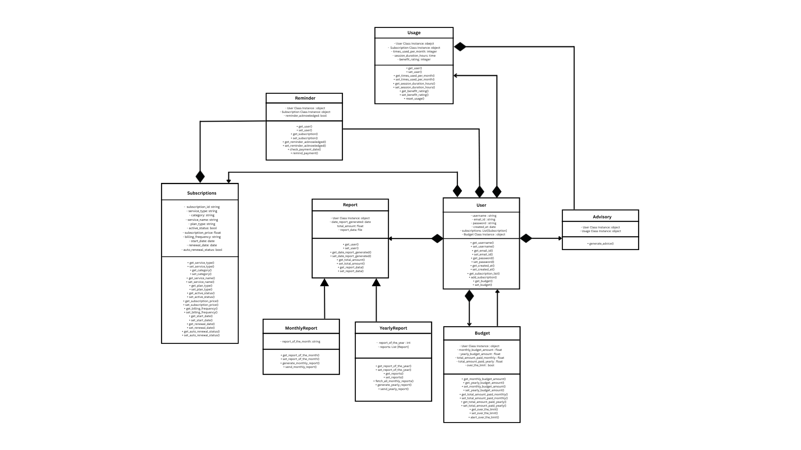

# TrackMySubs 📊🧾


**TrackMySubs** is a smart subscription tracking and budgeting system that helps users take control of their digital spending. The system monitors active subscriptions, evaluates usage behavior, provides budget management tools, and delivers actionable advice based on personalized data insights.

---

## 🚀 Features

* 📦 Track and manage multiple subscriptions
* 🔔 Smart Payment Reminders: Automatically reminds users to pay their subscription fees 3 days before the renewal date, helping them avoid missed payments.
* 💰 Define and monitor monthly and yearly budget limits
* 📈 Analyze subscription usage patterns over time
* 🧠 Receive personalized recommendations to optimize spending
* 📊 Automatically generate monthly/yearly financial reports
* 📧 Email reports directly to the user

---

## Project Overview

The system is designed using object-oriented principles. It includes components for handling users, subscriptions, budgets, usage patterns, reports, and advisory suggestions.

A UML diagram is available to visualize the relationships between different components.



---

## 🛠️ How to Use

Follow these steps to set up and run **TrackMySubs** locally:

### 1️⃣ Clone the Repository

```bash
git clone https://github.com/your-username/TrackMySubs.git
cd TrackMySubs
```

### 2️⃣ Create & Activate Virtual Environment

```bash
# Create virtual environment and activate it
pipenv shell

### 3️⃣ Install Dependencies

```bash
pipenv install -r requirements.txt
```

### 4️⃣ Run the Project

```bash
python main.py
```

### 5️⃣ (Optional) Run Tests

```bash
python -m models.test
python -m database.test_db_service
```

---

## 📌 Notes

* Ensure you are using **Python 3.8+**.
* All dependencies are listed in `requirements.txt`.

